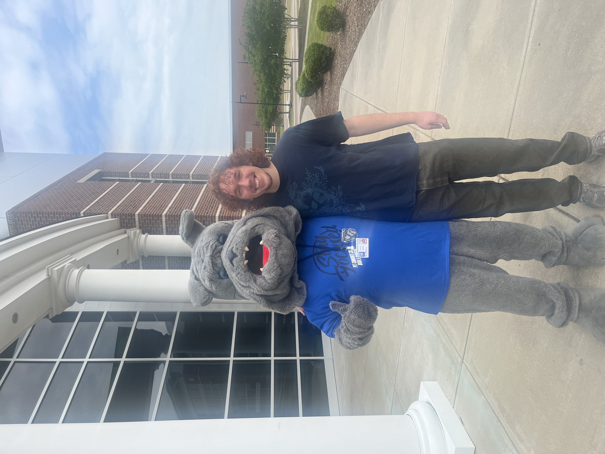
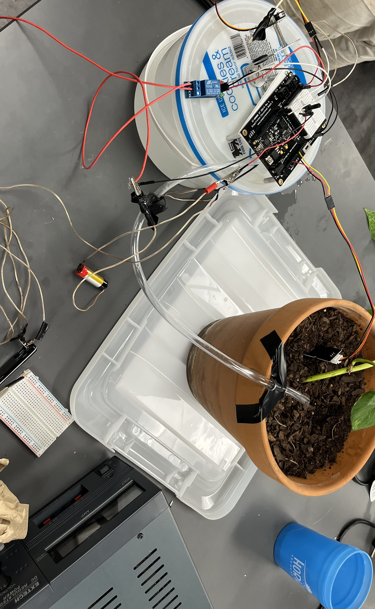

#About Me  
My name is Jack Welch. I was born and raised in Mooresville, NC and am in my sophomore year at UNC Charlotte and in my third year of higher education. As a kid, I loved the idea of building and creating something from my own ideas and with my own hands, and I had a fascination with how the things we use every day work, but as a kid I never realized engineering was where I could apply that passion. It wasn't until I began community college that I realized that Mechanical Engineering was where right for me. Being in community college, where there were few resources for real engineering work, allowed me to get accustomed to the fundamental math and physics that engineers must use to defend their work. From that, I knew that mechanical engineering and engineering in general were a passion of mine, because even without the hands-on application, I still enjoyed the work and felt proud about what I was doing. The engineer I am today is one eager to learn the workings of the world around me and find new and exciting ways to implement that knowledge into something feasible, useful, and creative.  I am excited to use the fundamental knowledge I have here at a new school that is granting me new possibilities and opportunities to excel in engineering. The engineer I am becoming is one who wants to go out into the world and use my education to improve people's daily lives. Not everyone can become an engineer, and becoming an engineer comes with a set of responsibilities to use what I have learned to benefit the world. In the meantime, I am excited to learn and excited to create.  

**What does it mean to defend an engineering decision?**  
Defending an engineering decision means backing any decision with extensive reasoning that is then backed up by data, research, and, engineering knowledge. I cannot say confidently that I can back an engineering decision to the standard of which they should be scrutinized, but I know how to begin and a basic process to take.  

  
Me at my first community college.  
  
Automatic plant watering system based on soil moisture data.  

