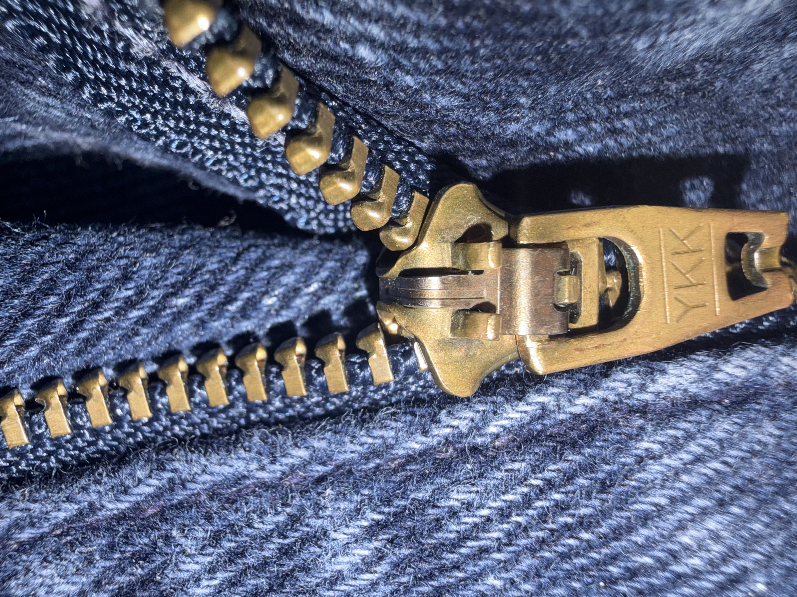
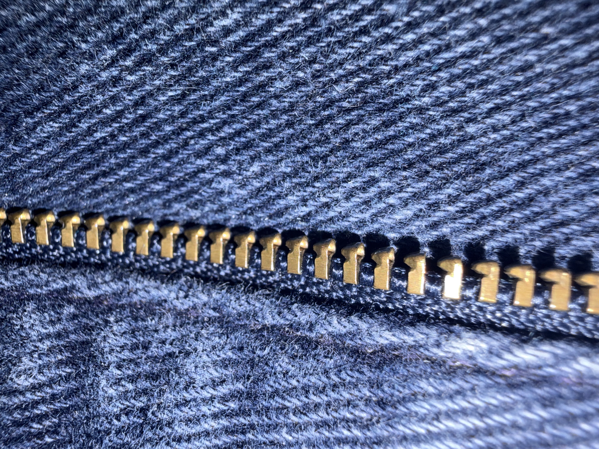

# A1 – Create portfolio

## Objective

## Analyze
**Part A: Portfolio Analysis**  

  -Portfolio 1: Allister Sequiera&nbsp;&nbsp;&nbsp;&nbsp; (https://allisterjsequeira.github.io/index.html)  
  &nbsp;&nbsp;&nbsp;&nbsp;Allister's portfolio opens to a grid display of what one would assume are his most notable projects, this makes them simple to locate and access any specific project. The photos and detailed but concise titles immediately communicate the purpose of his designs/projects. The photos are links to the details of each project, where he clearly details the process from CAD modeling to the completion of the final product. The language in the descriptions use plain and competent language, and includes data useful to any colleague looking to reproduce the work. He also explains decisions made during the process and why he made them, and includes data to support the decisions.  

  -Portfolio 2: Alexander Cape Jones&nbsp;&nbsp;&nbsp;&nbsp;(https://acapejones.github.io/#)  
  &nbsp;&nbsp;&nbsp;&nbsp;Alexander's Portfolio is well made but needs work in multiple areas. Although the language was appropriate for an engineering portfolio, I immediately noticed spelling errors in his about me page, and later in the projects page. His page of projects are in a listed format, with the pictures grouped one after the other with text preceding it. To navigate to any specific project, one would have to scroll through the list and find it, which is not ideal for a colleague or employer wishing to view his work. The descriptions of each project were quite short, and did not include much if any reasoning to why certain decisions were made during the process. They did not include enough information for replication, and were more like summaries of each project. 

***

**Part B: Product Analysis: The zipper or separable fastener**  

Primary function:  
  &nbsp;&nbsp;&nbsp;&nbsp;The primary function of the zipper is to connect and fasten two portions of fabric together temporarily, done by mechanically interlocking metal teeth, the teeth are individually joined to the fabric.  
  
  Governing Model:  
 &nbsp;&nbsp;&nbsp;&nbsp; The behavior of the zipper is governed by a pulling force (F) that controls the angle (θ) between both rows of teeth, with the input of pulling force, the angle between the teeth either increases or decreases to 0 depending on whether the zipper is going up or down. It is assumed the rows of are entering at equal and symmetric angles, if this were not the case, the teeth would not fit into place.  

 Component Geometry:

 Fastener  
  
The fastener has a Y or forking geometry that guides the rows of teeth together. The length of the pathways are important to the zippers mechanical function as it levels the rows equally so that the teeth will be aligned when connecting. The top and bottom sections of the fastener only connect at the top, the rest of the fastener that are not the teeth pathways have a gap between the top and bottom sections. This gap provides just enough space for the fabric to fit and easily slide up and down, while also keeping the fastener in place.  

Teeth  
  
The teeth have a clamp that attaches the teeth to the fabric, at the end of the clamp is the functional tooth. The teeth have a coned geometry with a domed tip, and the base of the cone is indented with the same domed shape. This allows each tooth to slide into the indented space of the above tooth on the opposite row. This geometry accomplishes the main of function of the zipper, adjoining the two sides of fabric and keeping them securely in place.  

Patent: Separable Fastener (https://patents.google.com/patent/US1219881A/en)   
Patent #: US1219881A  
Author: Gideon Sundback  

Alternative Solutions:  
-Plastic or metal buttons sewn to pants with holes on the opposite fabric end.  
-Holes on both end of fabric with offset placements and a string at the bottom of the seem that is then weaved through the holes and tied at the top  

Design Decision:  
In the original design of the zipper from 1914, the engineer included a trapezoid shaped metal loop at the top of each row of teeth. This was included in the design to be the end of the zipper and prevent the fastener from sliding off the end, its geometry allows it to fill in the forked pathways of the fastener but not move or connect, keeping the fastener in place.

## Decide

## Communicate

