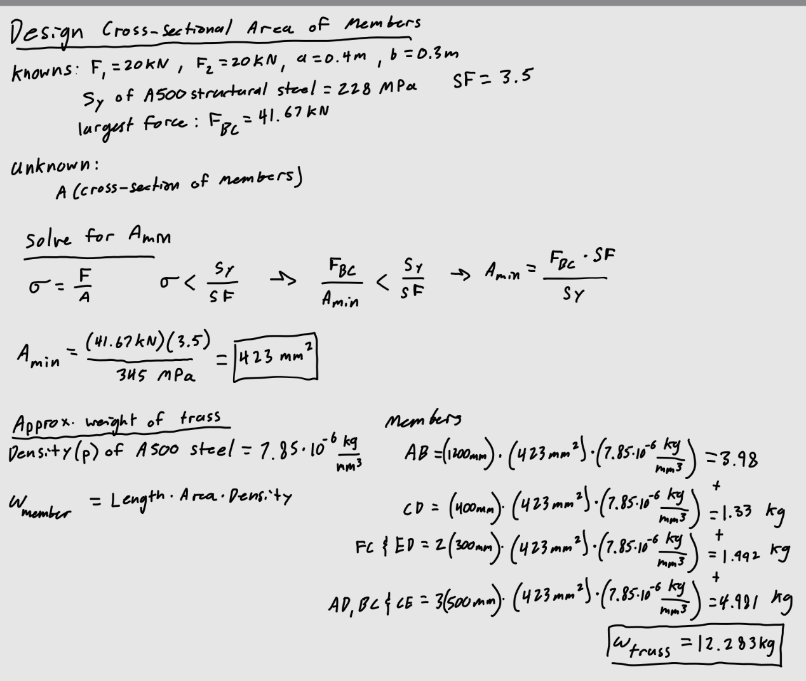
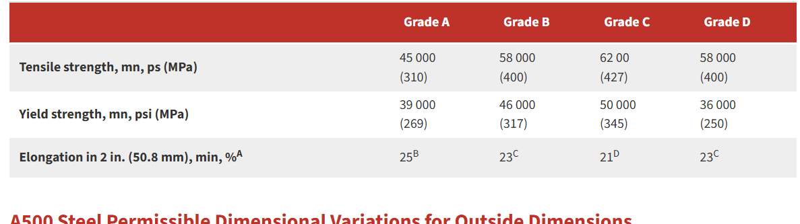
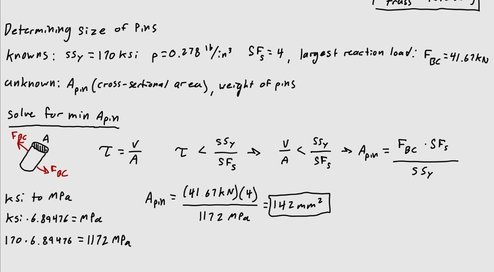
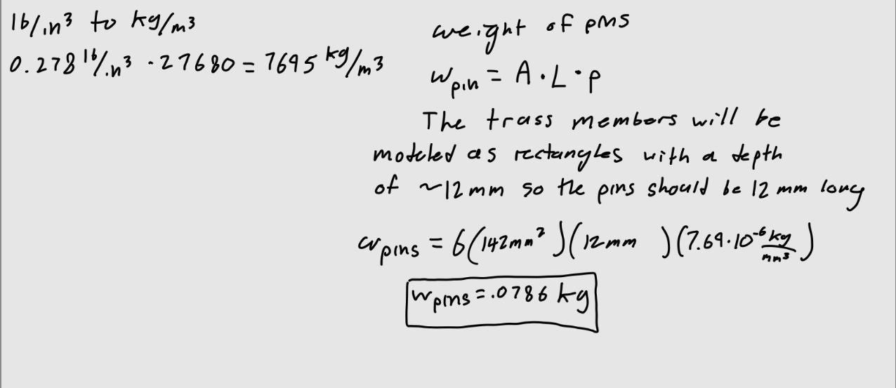
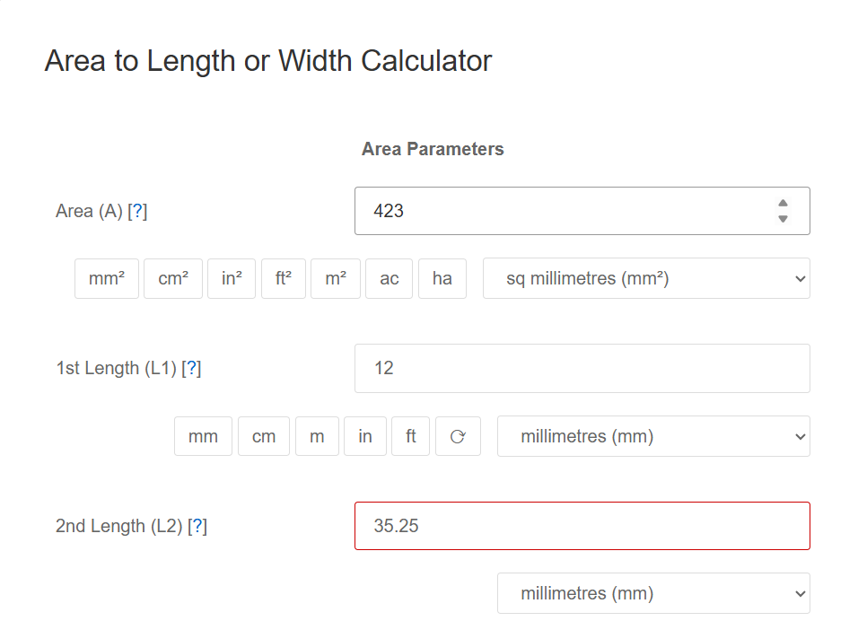
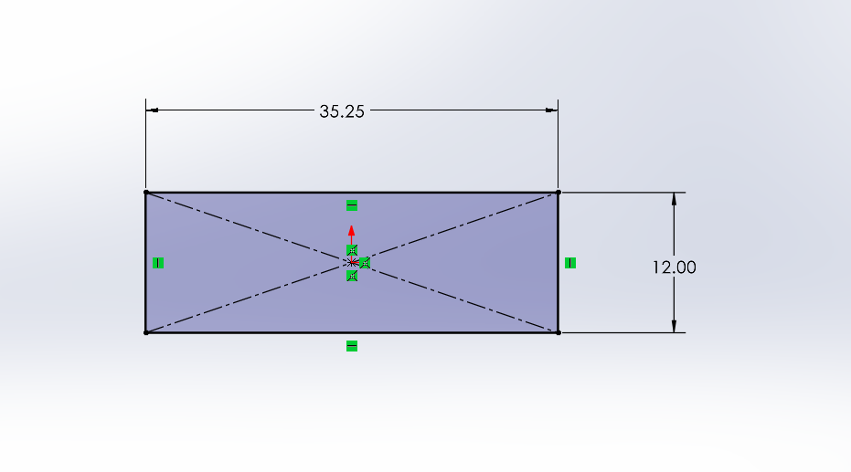
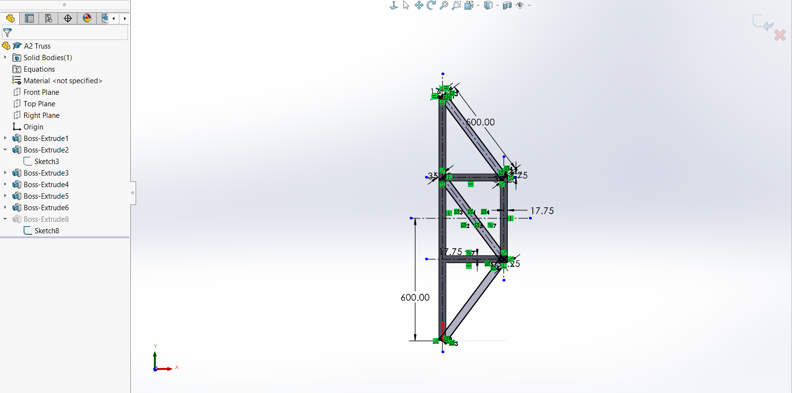
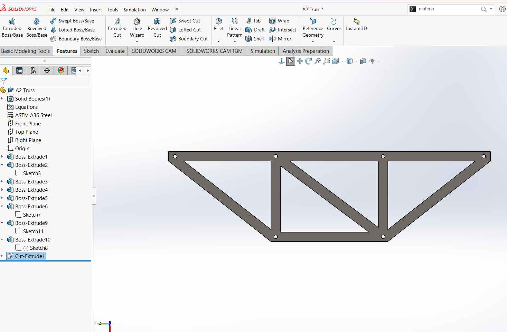

# A2 – Truss Stress Analysis

## Objective
-Design a lightweight planar truss using A500 steel or an alternative material.  
-Create free body diagrams (FBDs) for joints and critical pins.  
-Calculate the required cross-sectional area of truss elements with a safety factor.  
-Determine pin sizes based on shear forces with a safety factor.  
-Solve equations symbolically and numerically for both truss and pin design.  
-Estimate the total weight of the truss and pins.  
-Create a CAD model with accurate dimensions and connections.  
-Compare CAD weight predictions with hand calculations.  
-Document key engineering lessons learned from the process.  

## Analyze  
# Designing the Truss  
For my truss, I decided to use a simple design that consisted of only right triangles, which would allow for easier calculations.  
  

Next was to find the internal forces in each of the members, the goal being to find the maximum internal force, so I could later find the minimum cross-sectional area. First, I had to find the support reactions at pin A and roller B, the vertical reaction at B being of the most importance, because it allowed me to begin solving for forces at joint B.  
  

Then I solved for all of the internal forces using method of joints. Drawing a FBD of every joint.  

   

# Determining Minimum Cross-Sectional Area of the Members  

The next step was to calculate the minimum cross-sectional area of the members that would support the 20KN loads. I did this by relating the formula for stress with the relation between the yield strength and a given safety factor of 3.5. I also calculated the approximate weight of the truss, I calculated the members all separately, grouping them if they were identical. I found the weight by multiplying the length of the member by its cross-sectional area and density. I found the weight to be 12.283 kg, as can be seen below. I found the density of A500 steel online here:  (https://beamdimensions.com/materials/Steel/ASTM/ASTM_A500/)  
  

The yield strength for A500 steel is 345 MPa, which is info I found online at (https://www.tottentubes.com/astm-a500-specification-information).  
  
I decided on using grade C because I read that it was most commonly used in construction.  

# Determining Pin Size  

The cross-sectional area of the pins must also be found, to ensure the can support the members under shear stress. The same process is applied here that I did for the members. Using the largest internal force in the truss and comparing with the relation of yield shear strength and a safety factor. Both were given, the yield strength being 170 ksi and the SF being 4. I converted ksi into MPa to keep consistency.  
  

I then solved for the weight of the pins, using a given density of 0.278 lb/in^3. For consistency of units, I converted it to kg/mm^3.  
  

# Modeling the Truss and Pins  
Before modelling in SolidWorks, I used an online calculator (https://www.sensorsone.com/) to find acceptable dimensions for both my members and pins based on the cross-sectional area I calculated.  
  
These are the dimensions I decided to use for my members.  
  
I used these dimensions for all of the members of my truss during modeling.  

Modeling in progress and finished product with pin holes.  
    

I am interested in different ways I could have done this model, I disliked how many different extrudes I used, and felt it could've been done quicker and more efficiently. However, by dividing the extrudes into portions, this model could possibly be reused with altered dimensions quite easily.  

I dimensioned the model exactly as my hand drawn truss. This ensured all my calculations would apply as accurately as possible to the model. The calculation I could verify was the weight.  

SolidWorks does not have A500 steel by default. So I researched what the most similar steel was that SolidWorks had available. Which directed me to (https://blog.thepipingmart.com/metals/a36-vs-a500-steel-whats-the-difference/) which made it clear that A36 Steel would be a good option because of its similar yield strength to A500 Steel.  

## Decide
_Which geometry did you select, and why? This is your first open design choice in the course — defend it._

## Communicate

