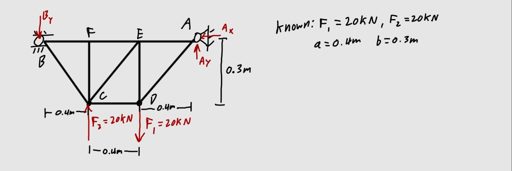
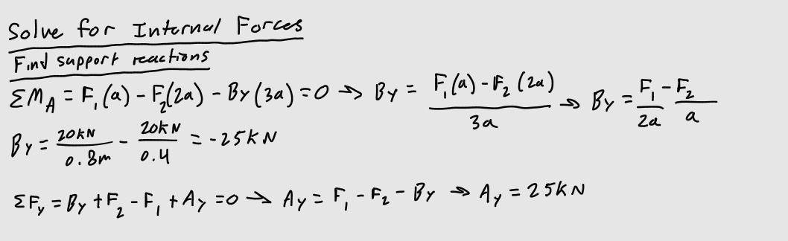
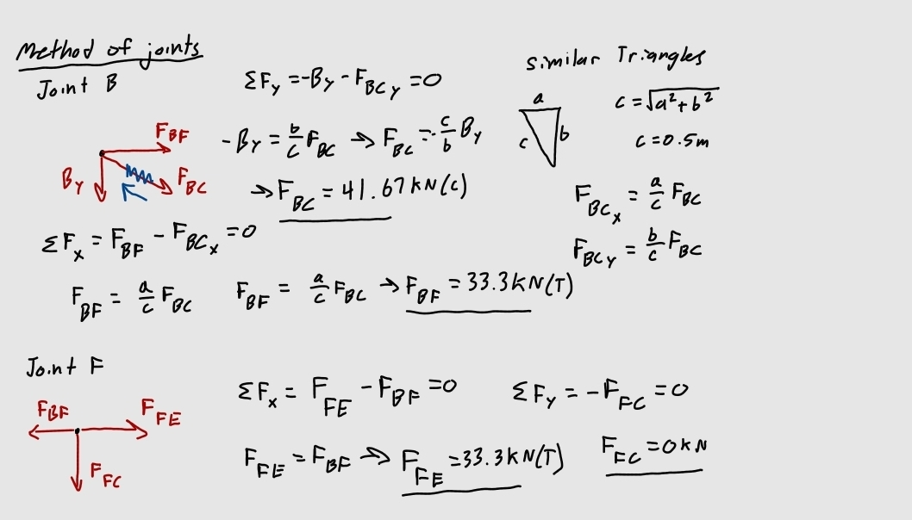
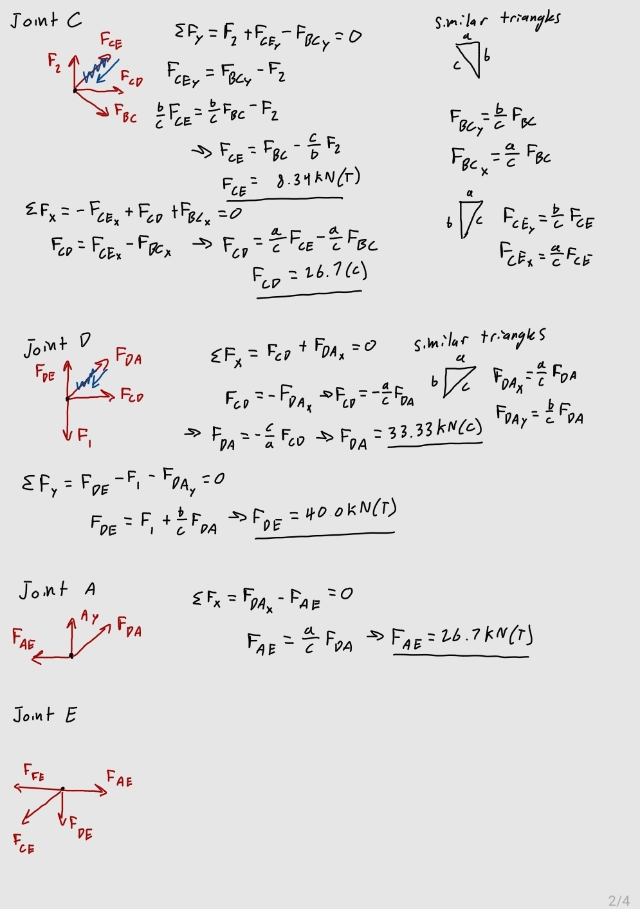

# A2 – Truss Stress Analysis

## Objective
-Design a lightweight planar truss using A500 steel or an alternative material.  
-Create free body diagrams (FBDs) for joints and critical pins.  
-Calculate the required cross-sectional area of truss elements with a safety factor.  
-Determine pin sizes based on shear forces with a safety factor.  
-Solve equations symbolically and numerically for both truss and pin design.  
-Estimate the total weight of the truss and pins.  
-Create a CAD model with accurate dimensions and connections.  
-Compare CAD weight predictions with hand calculations.  
-Document key engineering lessons learned from the process.  

## Analyze  
# Designing the Truss  
For my truss, I decided to use a simple design that consisted of only right triangles, which would allow for easier calculations.  
  

Next was to find the internal forces in each of the members, the goal being to find the maximum internal force, so I could later find the minimum cross-sectional area. First, I had to find the support reactions at pin A and roller B, the vertical reaction at B being of the most importance, because it allowed me to begin solving for forces at joint B.  
  

Then I solved for all of the internal forces method of joints. Drawing a FBD of every joint.  

   

# Determining Minimum Cross-Sectional Area of the Members  

The next step was to calculate the minimum cross-sectional area of the members that would support the 20KN loads. I did this by relating the formula for stress with the relation between the yield strength and a given safety factor of 3.5.  

## Decide
_Which geometry did you select, and why? This is your first open design choice in the course — defend it._

## Communicate

