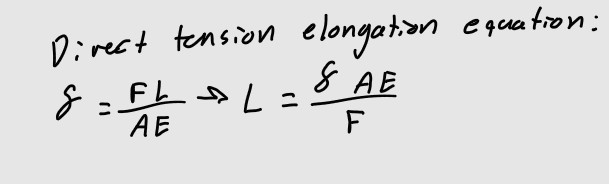
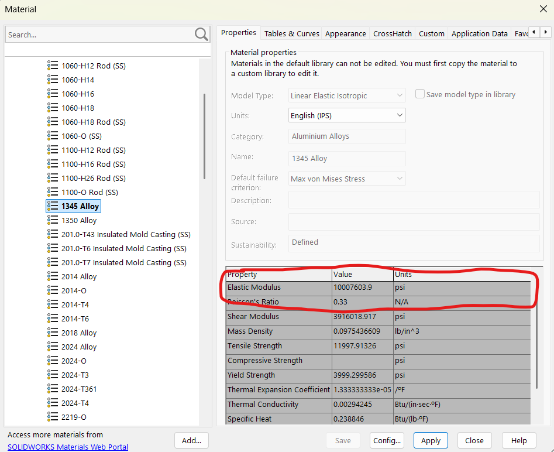
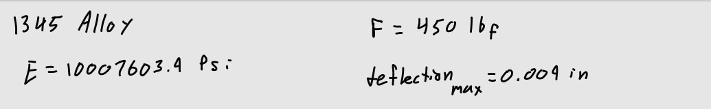
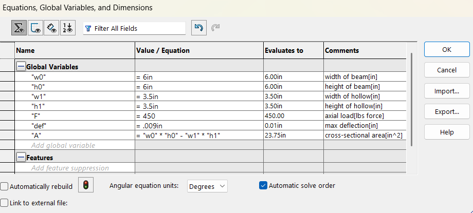
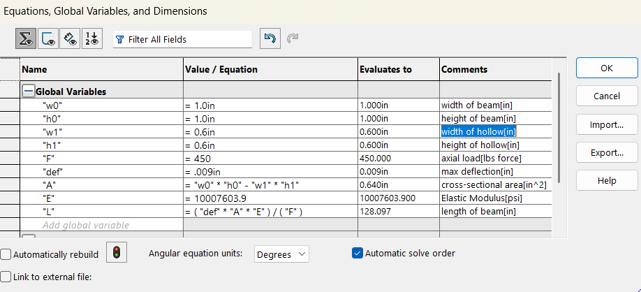

# A3 – [Topic]

## Objective  
*Use axial deflection modeling to design its dimensions  
*Use parametric design to determine a bars length  
*Introduce you to FEA (Finite Element Analysis)  
*Introduce you to linking dimensions to appropriate parameters in CAD.  
*Compare and contrast the different analysis  

## Analyze  

# Parametric Design  

To begin my parametric design of the hollow bar, I needed to choose and define multiple variables. These variables would allow me to solve for the bars length using the direct tension elongation equation. First, I chose my axial load to be 450lbf from the range of 300lbf < F < 500lbf. Next I needed to choose an aluminum alloy in SolidWorks to get a defined elastic modulus. The max axial deflection of the bar is given as 0.009 in.   

  
  

I chose 1345 alloy, this decision was essentially random. The Young's Modulus (E) for 1345 alloy was 10007603.9 psi.  

I began taking note of my values by hand to keep track of them as I designed.  
  

Next was to choose values for the height, width and thickness of the bar. I went through multiple options and trial and error until I finalized my dimensions. This was due to the final length of the bar being extremely long in comparison with it's cross-sectional area.  

My original dimensions were a 6in x 6in bar with a 3.5in x 3.5in hollow center and a thickness of 1.25 in.  

  

Using the tension elongation equation using these dimensions yielded a length in the multiple thousands of inches, which I realized may be unrealistic.  

I finalized on the dimensions 1.0in x 1.0in for the bar and 0.6in x 0.6in for the hollow center and a thickness of 0.2in.  

  

This yielded a length of 128.097in, which felt more reasonable and realistic.  

I now had all the needed dimensions of my bar to use for modeling, I directly inputted the dimensions using variables from my equations sheet into the dimensions of the model.  

 

## Decide

## Communicate

