# A4 – Motor Mount

## Objective  

Design a motor mount using the (Brushed 24V DC Gear Motor 3.6Kg.cm/46RPM w/ 99.5:1 Planetary Gearbox) which attaches to a rigid wall.  

## Analyze  

For this design I began by getting rough estimates of the required dimensions based on the drawing of the motor. The diameter of the the indent that houses holds the motor was 18mm, so I knew the base and height would be more than that to accommodate. I used the same reasoning for the height, the shaft of the motor was 18mm long, so I knew the height needed to be less than that to give clearance to the shaft. I also made the decision to use PLA as my material.   

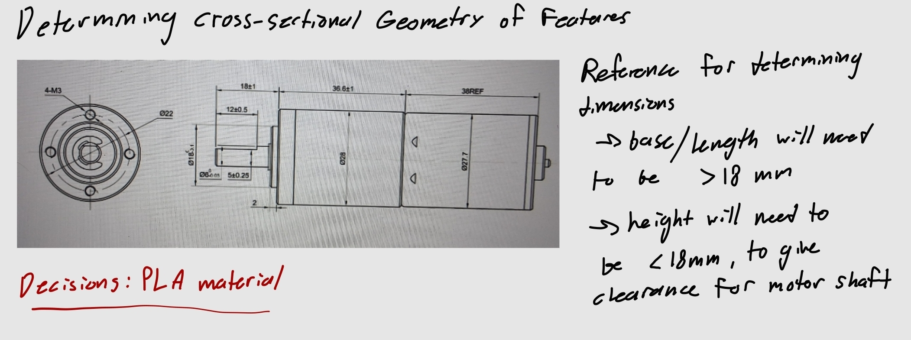  

I then needed to design the two features of the mount. Feature 1 being the part that holds the motor and feature 2 being the part that is fixed to the wall. I was given a safety factor of 3, a force of 300N that would apply to the moment of the features, and a max deflection of 0.30mm for both features. An online datasheet gave me the values for the Elastic Modulus and yield strength of PLA.   

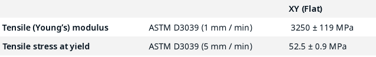  

## Feature 1  

For feature 1, I assigned a rectangular geometry, and chose a length and height based on the dimensions of the motor. The third dimension, the base, would then be solved for using the beam bending equations for a cantilever beam. Also using the max stress and yield strength relation to safety factor to solve for max stress.  

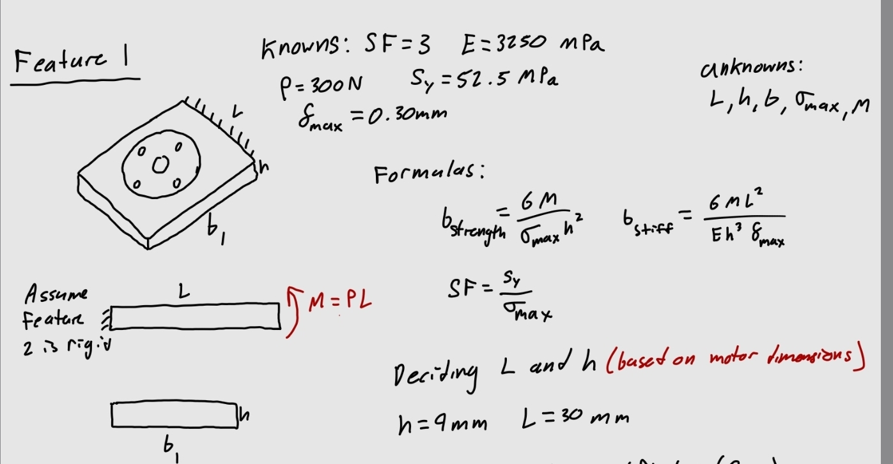  

I would need to solve for the base twice to find the actual minimum base required. Once considering the max stress and again considering the max deflection. The larger result of the two would need to be the minimum base of the rectangular feature.  

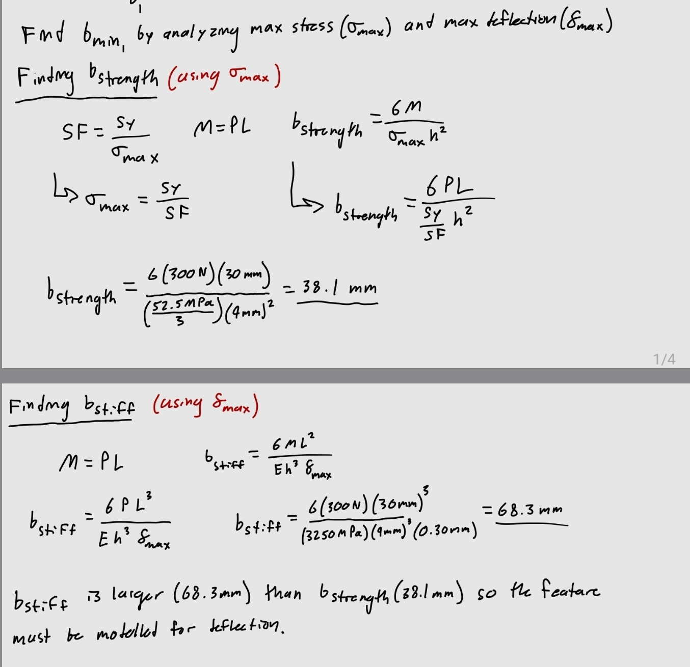  

I found that the deflection was of greater consideration in this feature, so it determined the minimum base.  

## Feature 2  

For feature 2 I chose a similar rectangular geometry but positioned vertically with a portion fixed to the wall and a free hanging portion that experiences a moment. For the length used in the moment equation, I chose a length of the feature that would be free hanging.  

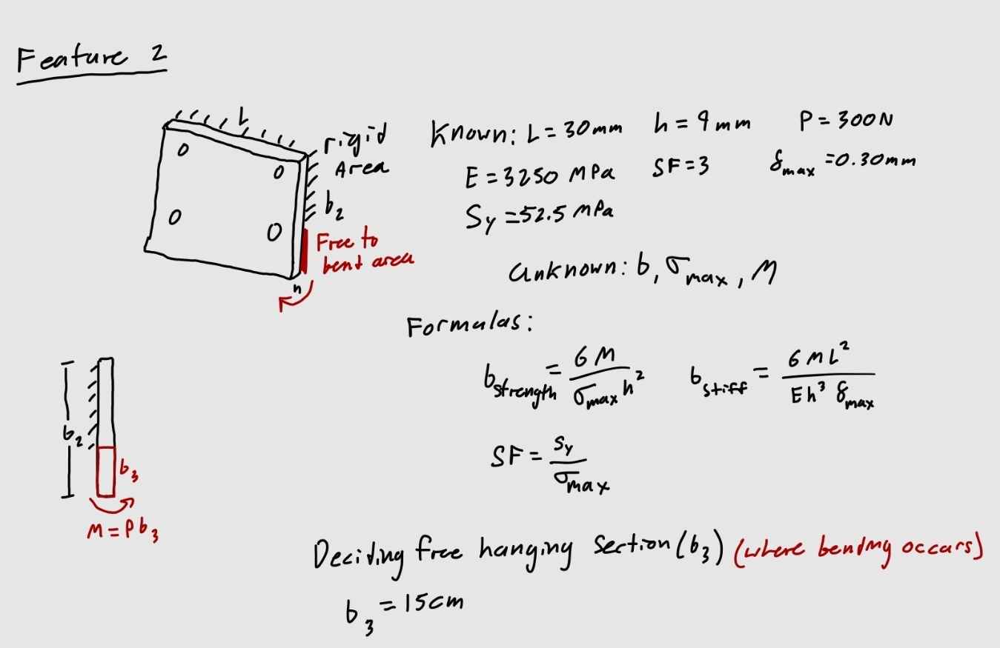  

I used the same method as I did for feature 1, solving for the minimum base with the beam bending equations based on max stress and deflection.  

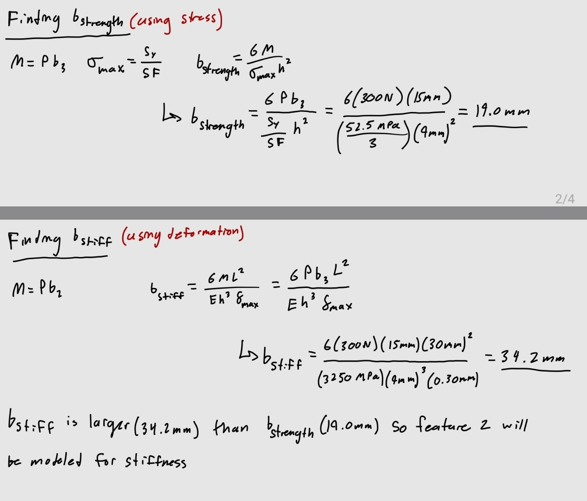  

Solving the beam equations came to the same result as feature 1, the max deflection determined the minimum base.  

## Sketch  

All the dimensions were solved for and the features could be combined into an isometric drawing.  

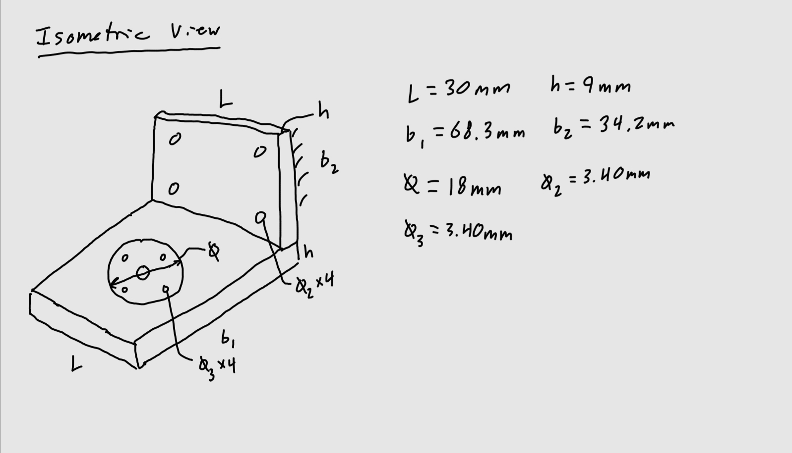  

## Decide  

## Parametric CAD Model  

My handwritten analysis was translated into the equations sheet in SolidWorks so that I could model the mount parametrically.  

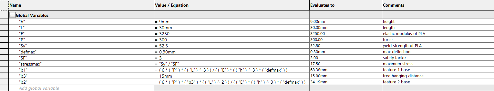  

I then inputted these variables into the model. Starting with feature 1. The height of 9mm was extruded.   

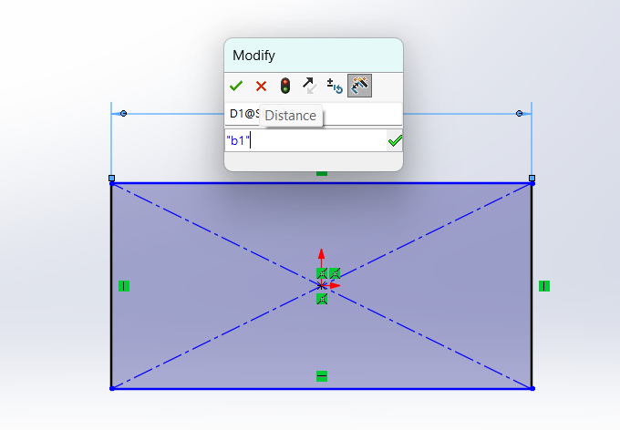 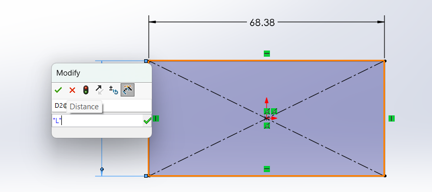  

Then I made a sketch on top of feature 1 for feature 2, the original dimensions were the length which I kept consistent with feature 1, I also kept the height 9mm consistent with feature 1. Although, the "height" here is more of a depth, I just kept the variable to keep the equations consistent.  

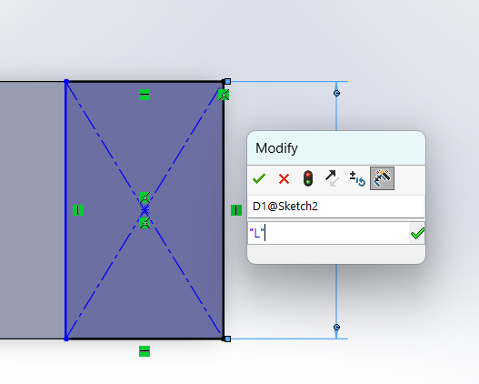 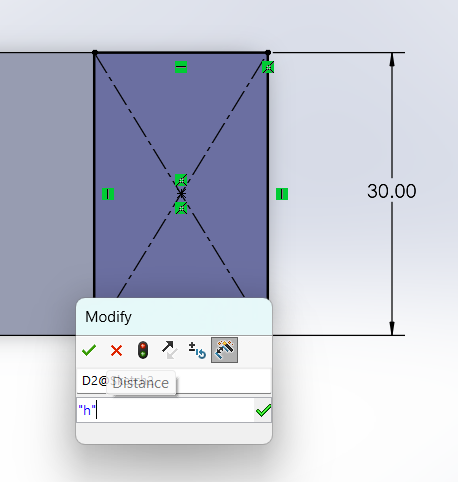  

I then extruded the feature with the base value I solved for.  

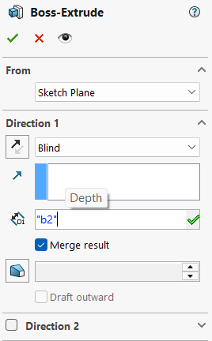  

With the basic dimensioned shape modeled I could then extrude the holes for the extrusion of the motor connected to the shaft, the shaft, and the bolts connecting the motor to the mount. All of the dimensions could be determined from the drawing of the motor.   

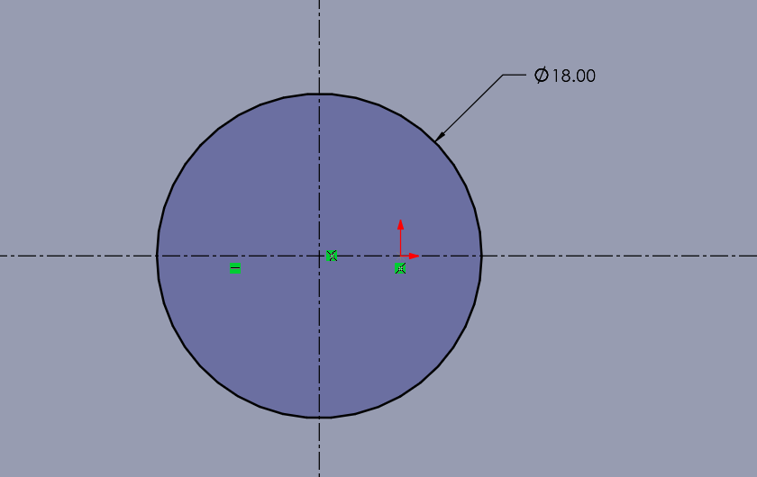 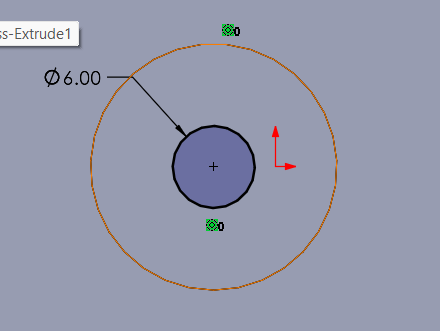 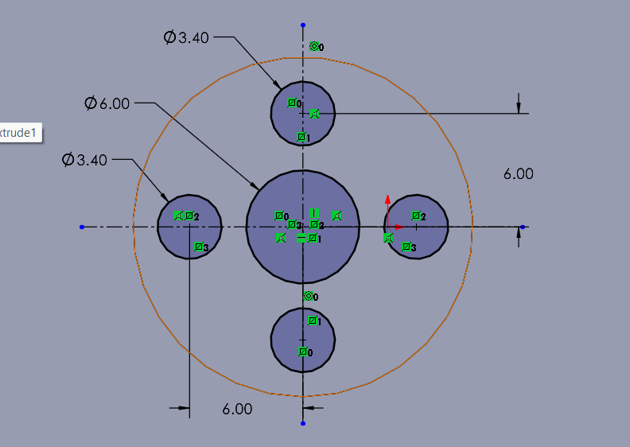   

I also designed the wall mount bolt holes, I used the same dimensions as I did for the motor's bolts.  

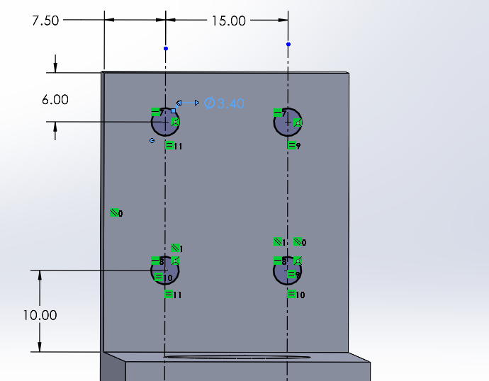  

I then created a small support near at the connection between the features, designed to minimize the deflection, this is of most importance for my design as the max deflection determined the geometry of the features. I figured this connection would be a strong support and its hollow structure limits material used.   

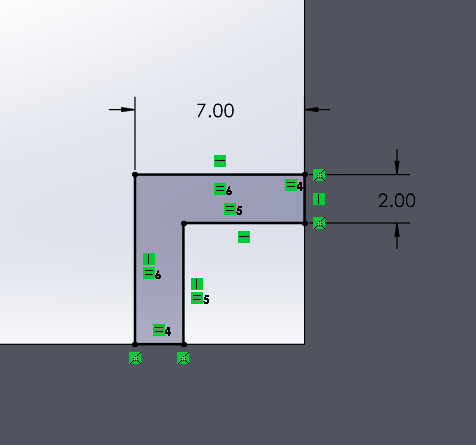  

**Final model:**  

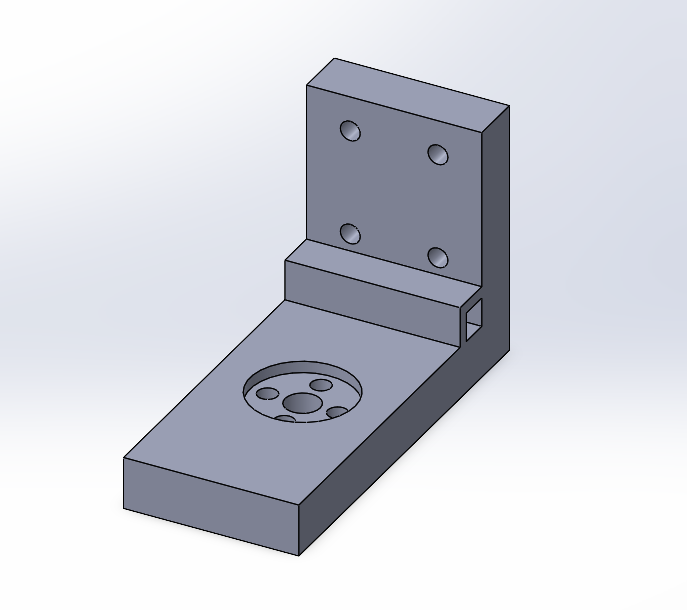  

**Link to model:**  https://drive.google.com/file/d/1Y-TXozJxxkJ-OtSlKfQwZwaB3Mtvkks7/view?usp=sharing  

## Drawing  

I then created a drawing in SolidWorks to represent my model, fully dimensioned.  

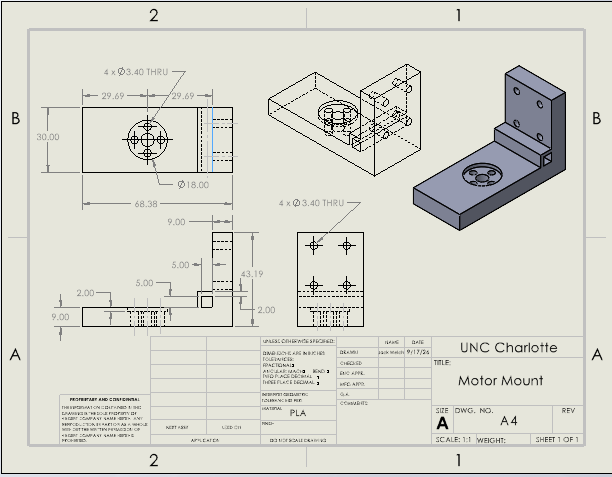  

**Link to drawing:** https://drive.google.com/file/d/1CU3Z5C90ZZrC_lIc1Vem6oC0UJp_FjaU/view?usp=sharing  

## Communicate

**Lessons Learned:**  

During this assignment I learned that using my judgement and editing with trial and error is a strong strategy when designing, while dimensioning I spent some time trying a few different combinations, and learned how they interacted within the beam bending equations.  
I spent about 8 hours on this design from start to finish.  
