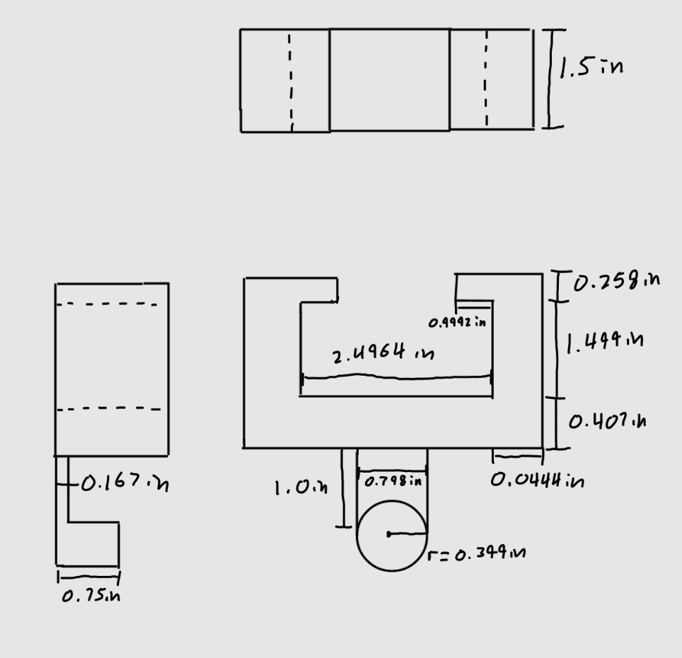
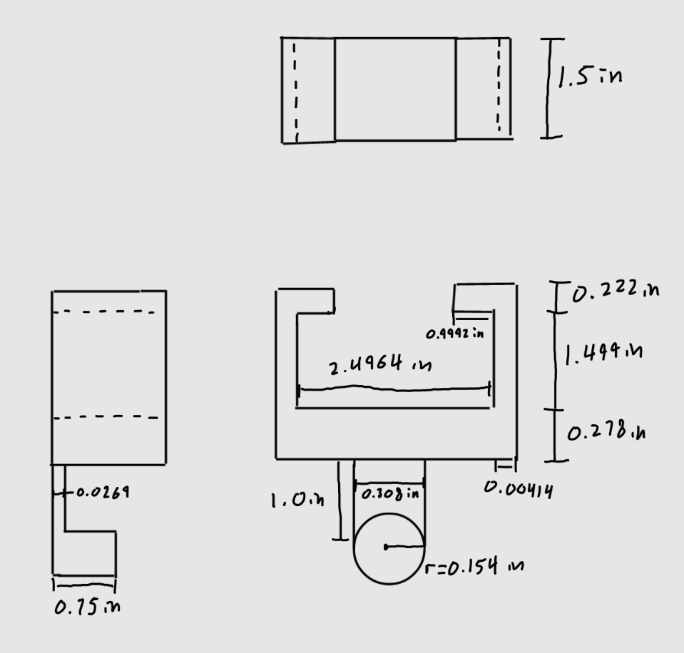
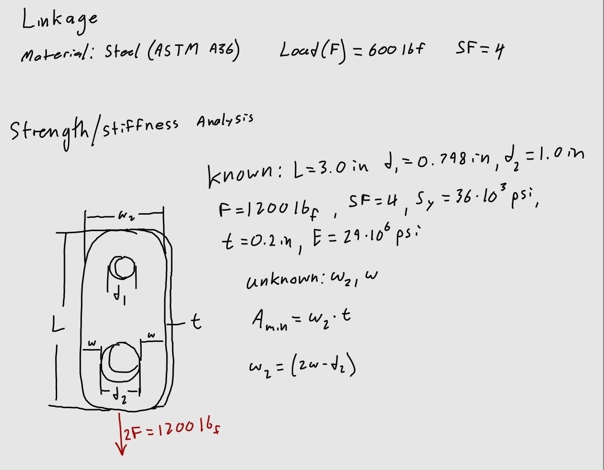
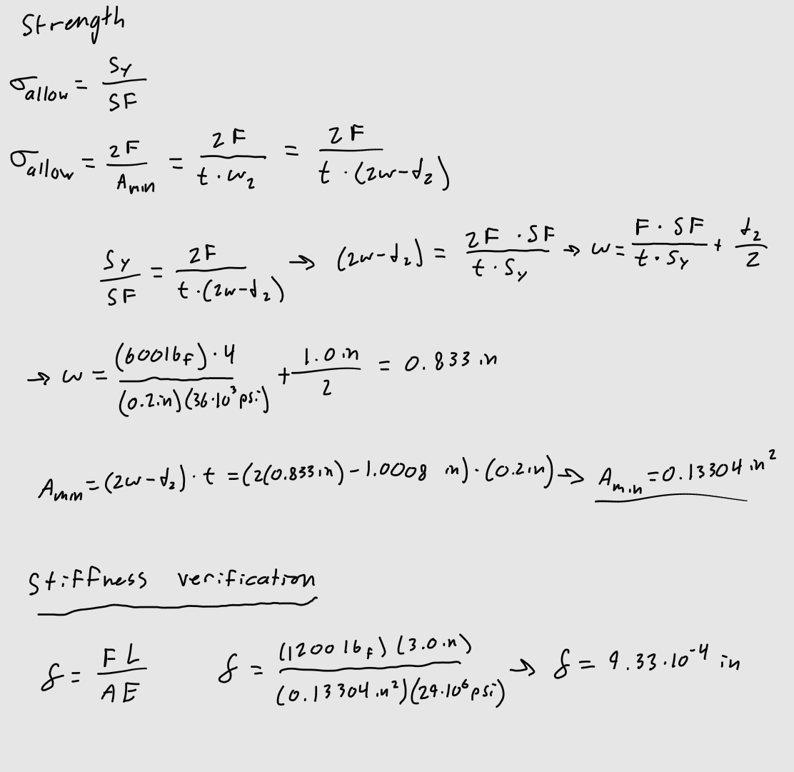
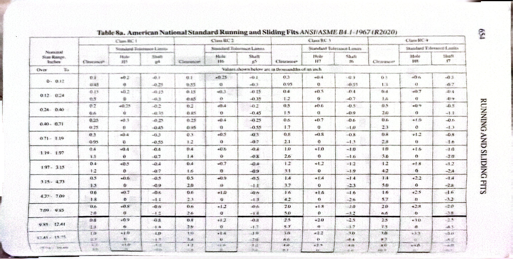
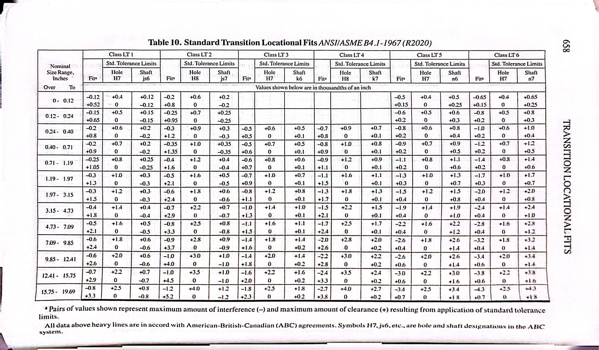

# A5 – Bracket Design 

## Objective

-Conduct stress analysis to determine appropriate dimensions for structural features.  
-Generate free body diagrams (FBDs) to visualize forces and constraints for each feature.  
-Identify and document known and unknown variables, assumptions, and algebraic models for stress calculations.  
-Perform stiffness analysis to establish minimum required dimensions based on deflection constraints.  
-Compare stress and stiffness analyses to ensure structural integrity and compliance with given constraints.  
-Create detailed multiview sketches illustrating dimensions derived from both stress and stiffness analyses.  
-Reflect on and document key engineering lessons learned throughout the process.  

## Analyze
To design this bracket the dimensions for multiple features needed to be analyzed for strength and stiffness requirements. I will use equations sourced from the Machinery's Handbook and treat the features as different beams/bars, and making assumptions to make these work. I will find minimum dimensions for these features for both strength and stiffness and the largest of the two will govern the final dimensions of the design.  

The part is a bracket designed to fit into a rigid T-beam and hold a load through a U-line strap.  

First I made decisions on material and the load. I chose Steel (ASTM A36) which has a yield strength of 36 ksi and a Young's Modulus of 29*10^3 ksi, and a load of 600lbf.  

  

## Strength Analysis  

First I solved for minimum dimensions governed by the max allowable stress with a safety factor of 4.  

I treated the cylindrical bar holding the strap as a cantilever beam, the length was determined by the width of the U-line strap.  

  

Next was the bar connecting the cylinder to the features interacting with the T-beam, which I treated as an axially loaded bar.  

  

Next was the bottom flange that acts as a simply supported beam on both sides with a load at the center, the length was found by the given dimensions of the T-beam. I decided a width that was about equal to the length to make it a square.  

  

Feature D needed to be treated similarly to feature B as an axially loaded bar.  

  

Feature E needed to be treated as a simply supported beam like feature C.  

  

## Stiffness analysis  

Next I needed to do an analysis based on stiffness to determine if the minimum dimensions would be more than those based on strength. I would use a deflection of 0.005 inch for all of the features. The formulas for deflection and moment of inertia when needed were found from the Machinery's Handbook.  

I went through the same process of analyzing each feature, using the same chosen dimensions when possible.  

  
  
  
  
  

I made two drawings based on each analysis.  

Strength analysis:  

  

Stiffness analysis:  

  

## Linkage Part  

Finally I would design a link that connects the feature A cylinder with another 1.0 inch diameter shaft that holds the U-line strap. I calculated the minimum cross-sectional area, which occurs at the widest part of the shaft hole. I then verified the area and chosen length using the axial deflection equation, this is to ensure the dimensions do not result in an excessive deformation.  

   

The hole for feature A is to be a Running/Sliding fit, and the hole for the shaft is a locational transition fit. To account for these fit types, I used the appropriate hole tolerances in the tables in the Machinery's Handbook. 

For feature A's hole, which has a diameter of 0.798 inch, has a tolerance of 0.4 thousandths of an inch, which was added onto the diameter of the hole.

  
(Machinery's Handbook, pg. 654)  

For the shaft, with a diameter of 1.0 inch, a larger clearance was needed, and a locational transition fit needed to be used. The tolerance needed for the hole was 0.8 thousandths of an inch.  

  

## Decide  

I made two drawings based on each analysis.  

Strength analysis:  

  

Stiffness analysis:  

  

## Communicate  

**Lessons Learned:**  

Failure mode:  
For feature C, stress required a height of 0.407 inch, and stiffness required 0.278. This difference made the most sense to me because it had a concentrated load on one end which created a relatively large moment. The feature is supported on both sides and has a width almost equal to the length, which result in less deformation.  

Error propagation:  
There weren't any errors that propagated through my calculations, this is due to the fact that I double check all my units before solving and moving on to the next question, this is usually where my errors in solving occur.  

Assumption Sensitivity:  
An assumption I made for feature B was that the curved end of the bar was ignored. This was a safe assumption to make because this is just where the bar met the cylinder beam, is essentially one piece and it wasn't as important to know how it ended, but the majority of the bar was a rectangle. This would change things if this were different because normal stress would have been different at this end where the load was concentrated.  

