# A5 – Bracket Design 

## Objective

-Conduct stress analysis to determine appropriate dimensions for structural features.  
-Generate free body diagrams (FBDs) to visualize forces and constraints for each feature.  
-Identify and document known and unknown variables, assumptions, and algebraic models for stress calculations.  
-Perform stiffness analysis to establish minimum required dimensions based on deflection constraints.  
-Compare stress and stiffness analyses to ensure structural integrity and compliance with given constraints.  
-Create detailed multiview sketches illustrating dimensions derived from both stress and stiffness analyses.  
-Reflect on and document key engineering lessons learned throughout the process.  

## Analyze
To design this bracket the dimensions for multiple features needed to be analyzed for strength and stiffness requirements. I will use equations sourced from the Machinery's Handbook and treat the features as different beams/bars, and making assumptions to make these work. I will find minimum dimensions for these features for both strength and stiffness and the largest of the two will govern the final dimensions of the design.  

The part is a bracket designed to fit into a rigid T-beam and hold a load through a U-line strap.  

First I made decisions on material and the load. I chose Steel (ASTM A36) which has a yield strength of 36 ksi and a Young's Modulus of 29*10^3 ksi, and a load of 600lbf.  

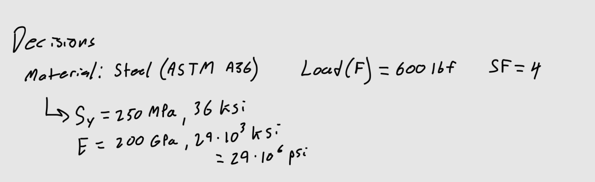  

First I solved for minimum dimensions governed by the max allowable stress with a safety factor of 4.  

I treated the cylindrical bar holding the strap as a cantilever beam, the length was determined by the width of the U-line strap.  

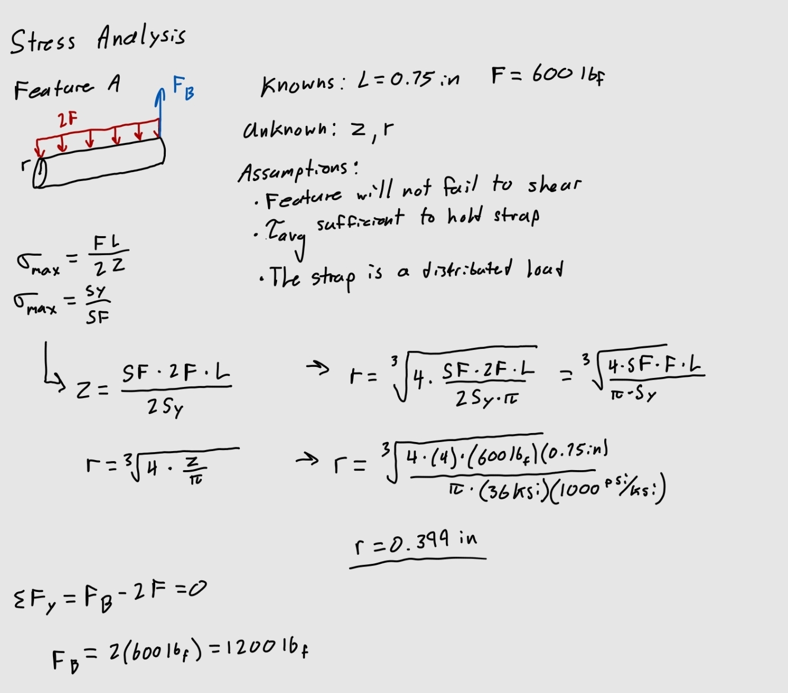  

Next was the bar connecting the cylinder to the features interacting with the T-beam, which I treated as an axially loaded bar.  

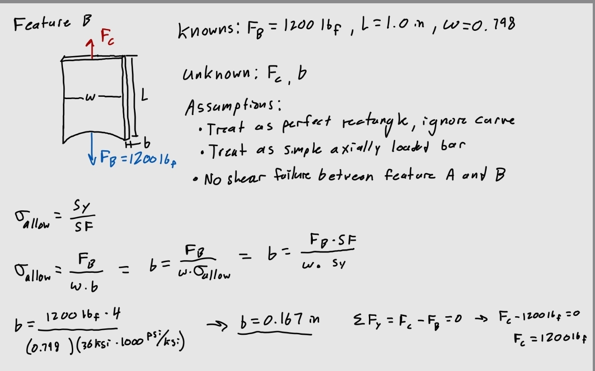  

Next was the bottom flange that acts as a simply supported beam on both sides with a load at the center, the length was found by the given dimensions of the T-beam. I decided a width that was about equal to the length to make it a square.  

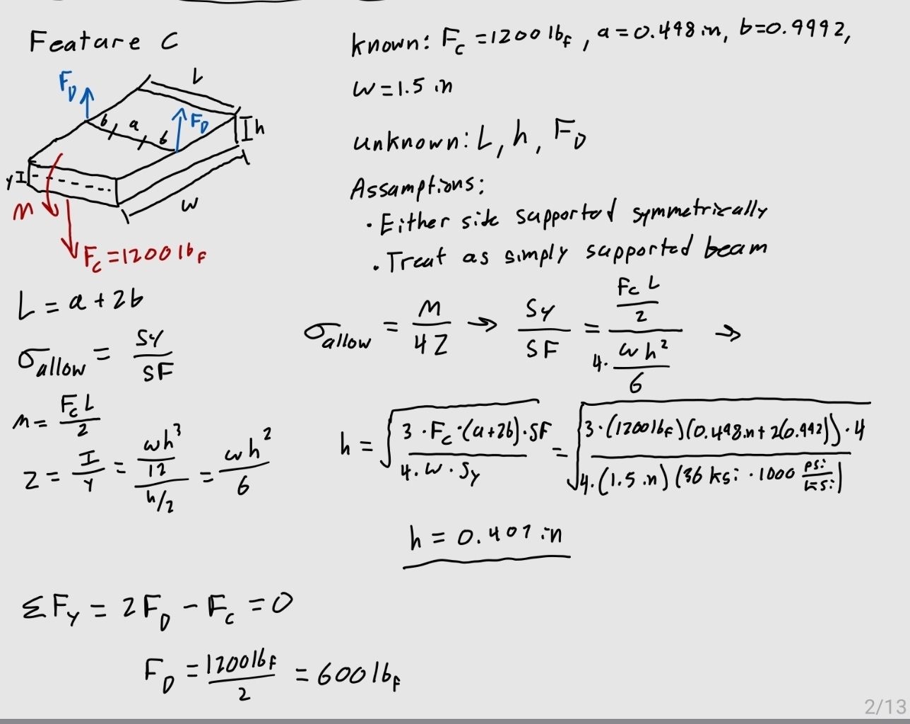  

Feature D needed to be treated similarly to feature B as an axially loaded bar.  

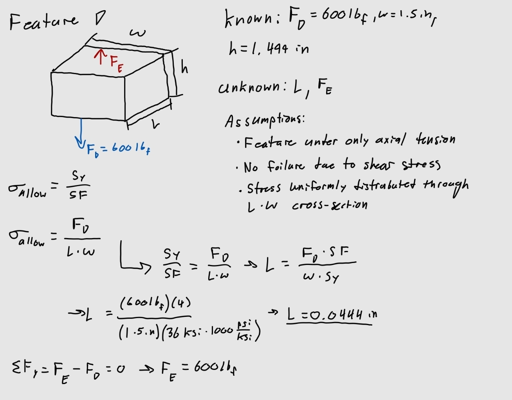  

Feature E needed to be treated as a simply supported beam like feature C.  

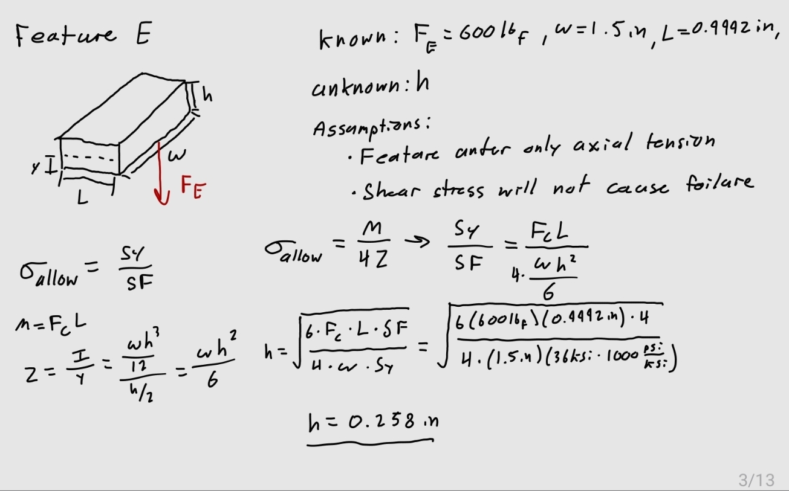  

Next I needed to do an analysis based on stiffness to determine if the minimum dimensions would be more than those based on strength. I would use a deflection of 0.005 inch for all of the features. The formulas for deflection and moment of inertia when needed were found from the Machinery's Handbook.  

I went through the same process of analyzing each feature, using the same chosen dimensions when possible.  

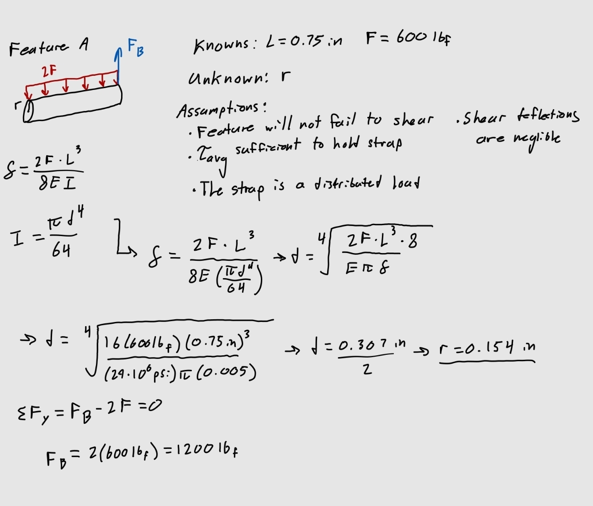  
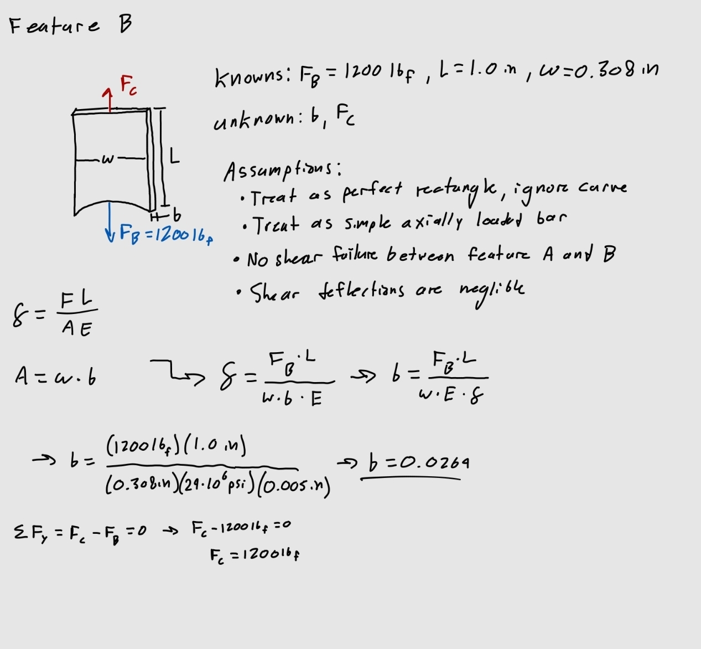  
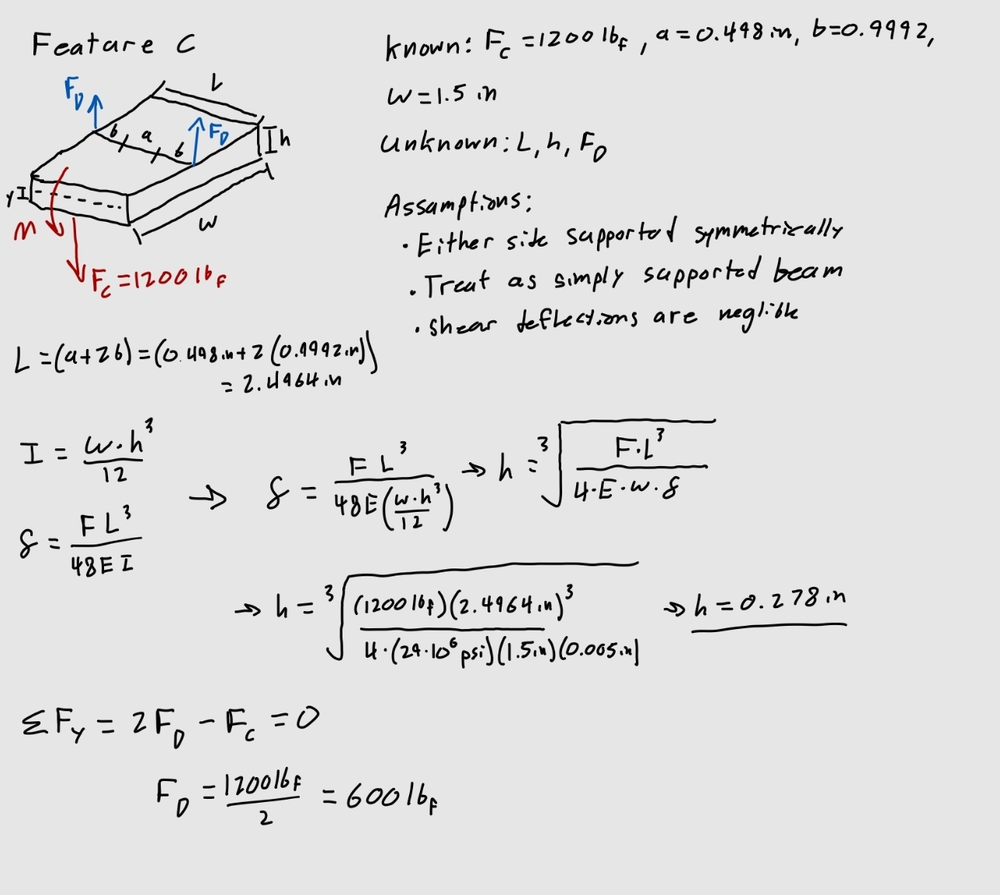  
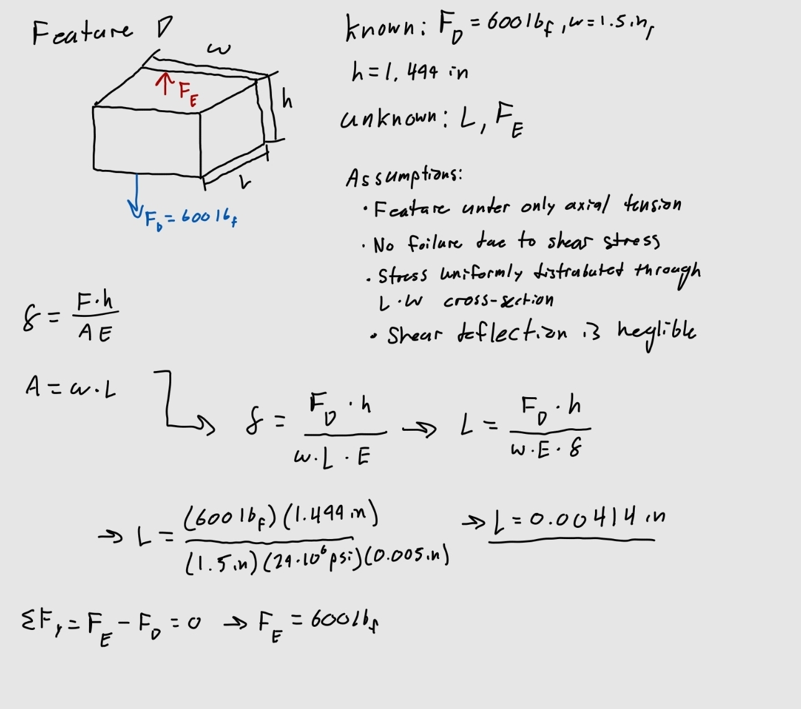  
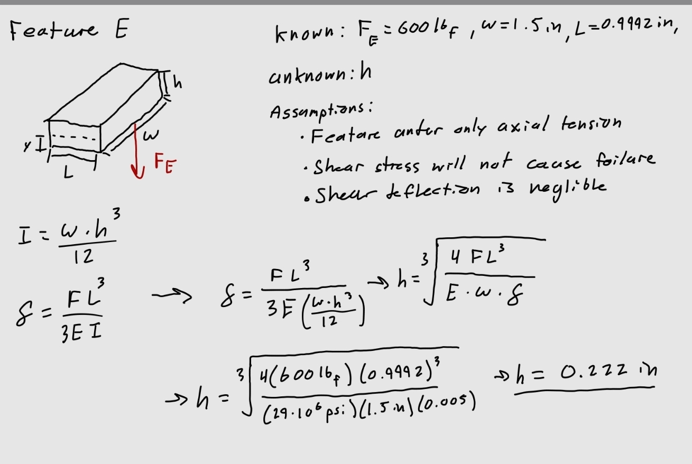  

I made two drawings based on each analysis

## Decide

## Communicate

