# A6 – Bracket Drawing

## Bracket Parametric Design  

My model was designed from my previous calculations of the bracket. All of the features depended on my strength calculations, none of my stiffness calculations yielded a larger minimum dimension. I translated my handwritten work into the equations sheet in SolidWorks so I could parametrically design.  

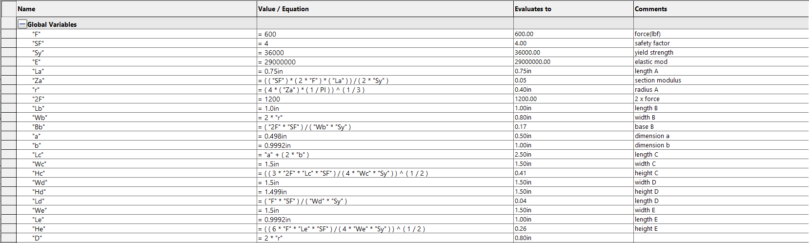  

I then designed the bracket based on these equations. This process was quite straightforward.  

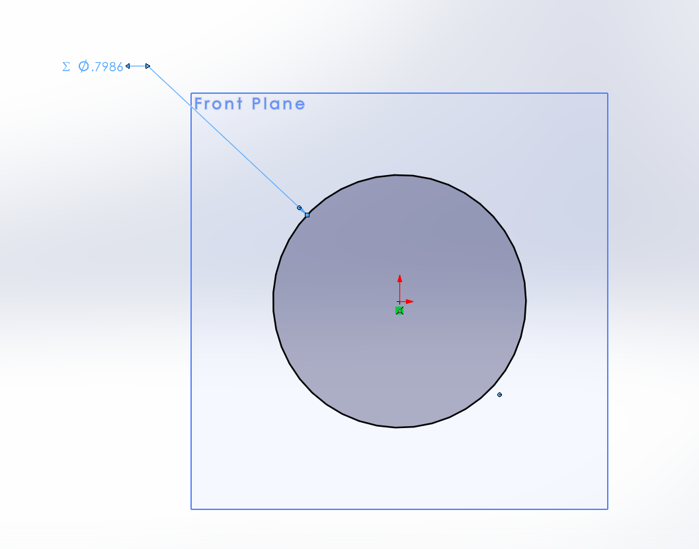 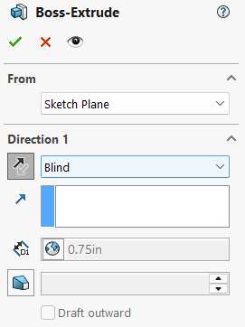 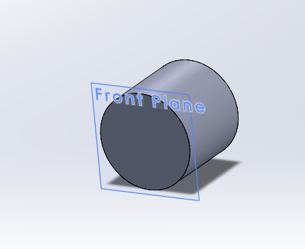 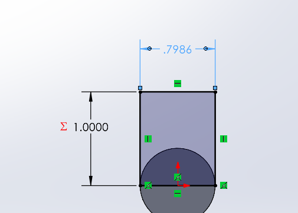 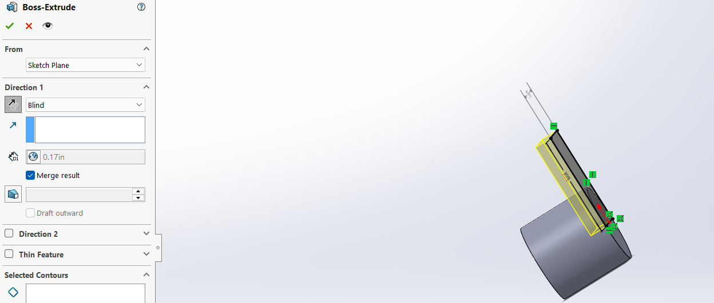 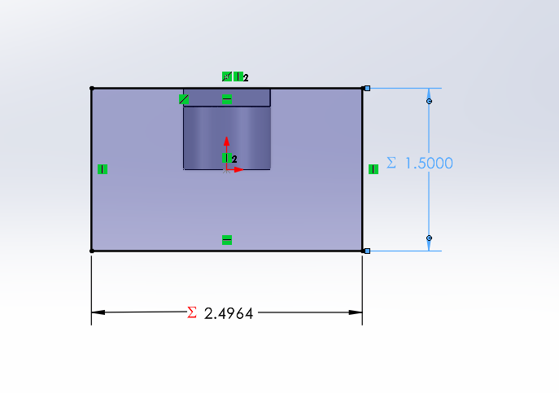 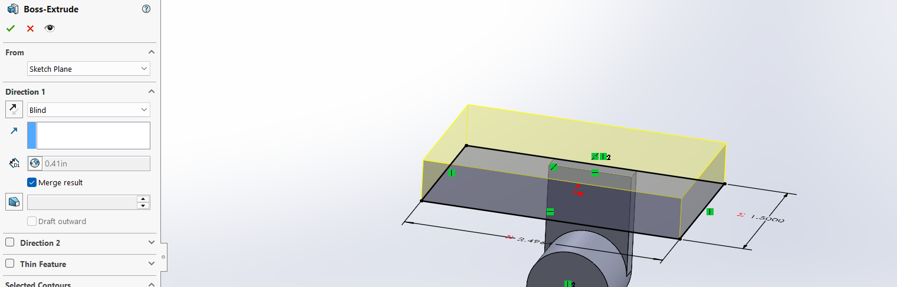 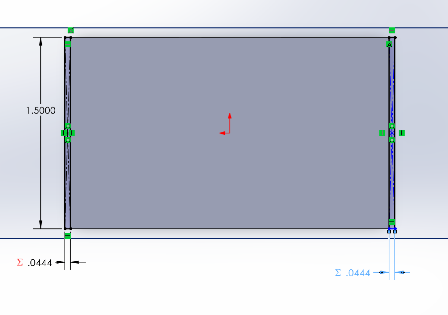 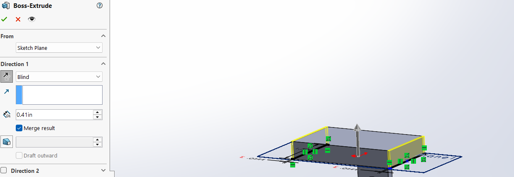 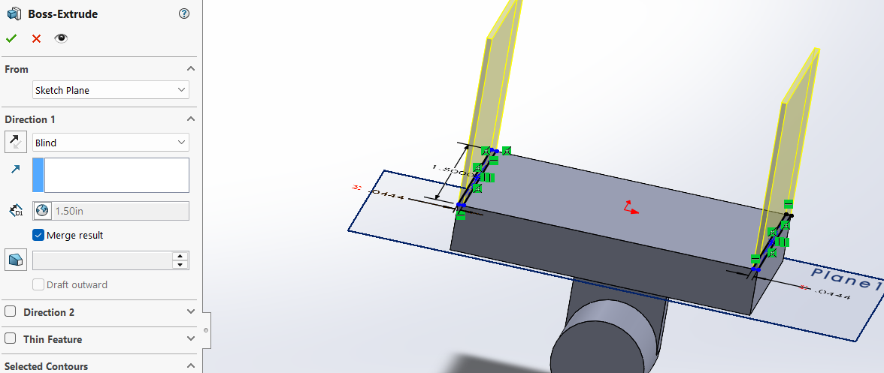 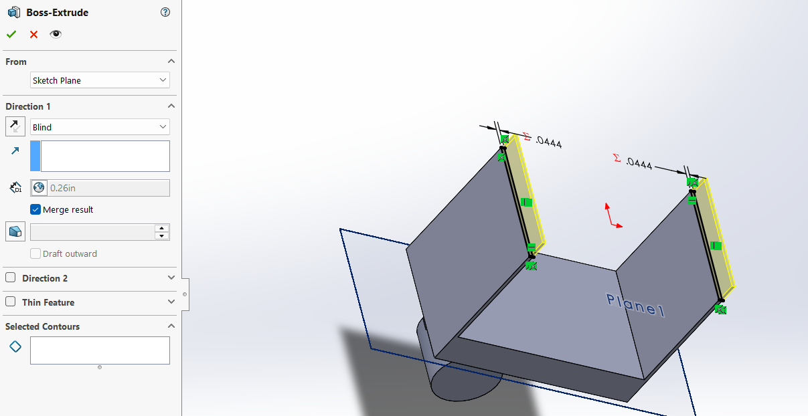 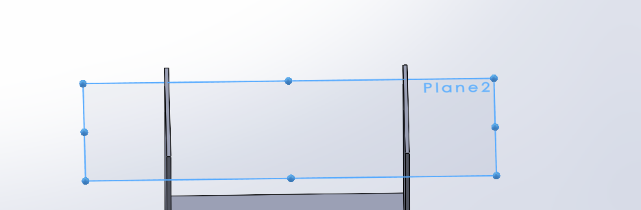 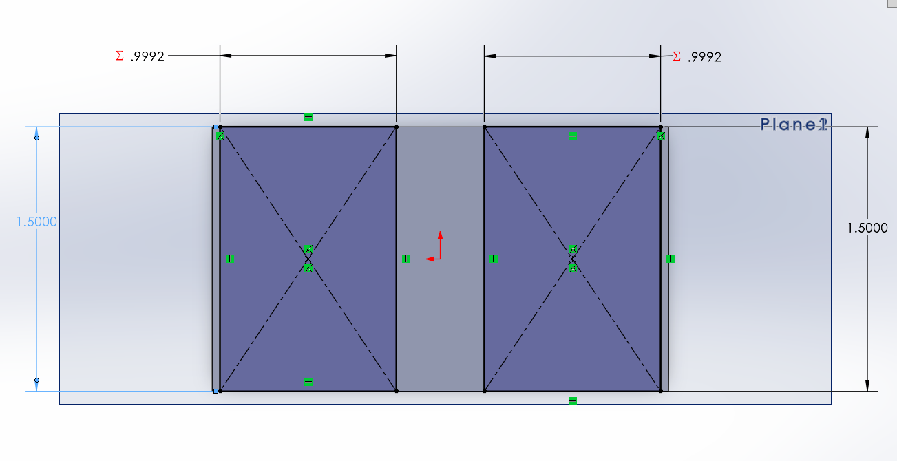 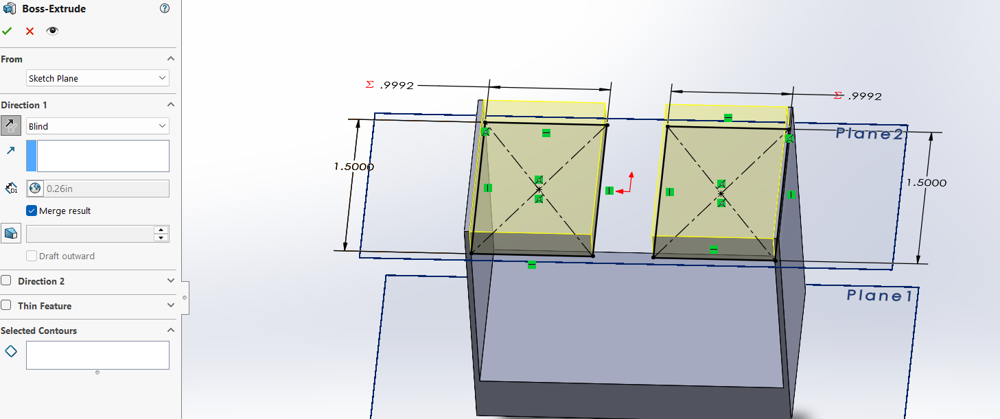 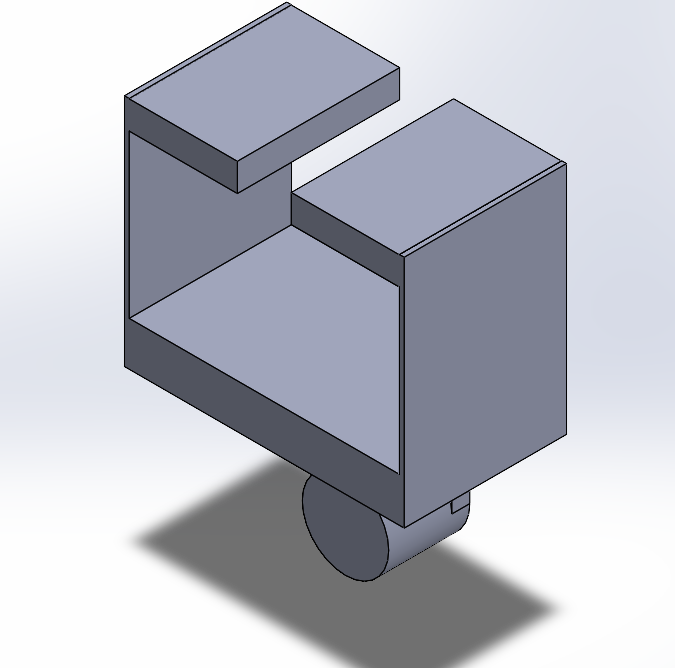  

This model was then to be put into a technical drawing, with an emphasis on the tolerances on the features that would interact with a T-beam

## Decide

## Communicate

