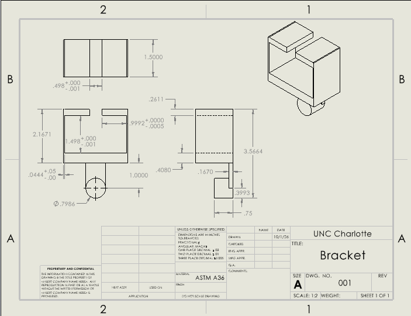
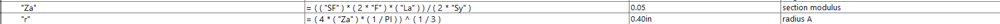

# Topic – Bracket Drawing

## Bracket Parametric Design  

My model was designed from my previous calculations of the bracket. All of the features depended on my strength calculations, none of my stiffness calculations yielded a larger minimum dimension. I translated my handwritten work into the equations sheet in SolidWorks so I could parametrically design.  

  

I then designed the bracket based on these equations. This process was quite straightforward.  

                

## Bracket Drawing

This model was then to be put into a technical drawing, with an emphasis on the tolerances on the features that would interact with a T-beam, of which there were three. I also added a tolerance on the sides, which were feature D.  

  

## Reflections/Lessons Learned   

I learned multiple new tools in SolidWorks drawings, including the ability to add tolerances to dimensions and how to use the geometric tolerances, although I know I have more to learn the meaning of the datums and the different symbols. Throughout my recent assignments and in this bracket modelling especially I have discovered the usefulness of parametric design and the importance it puts on proper calculations. I am also aware I have more to learn on fit types and classes, and to learn when to use each specific class or type. 

For feature A I used formulas for the bending of a beam supported at one end with a uniform load, I split it up into the section modulus(Z) combined with the equation relating max stress, yield strength and the safety factor. I then input the section modulus into an equation solving for the radius of the cylindrical beam.  

  

When I was modeling feature A instead of typing the given dimension, I typed ="r", this allows me to change the dimension by making changes to the equations sheet, which would then directly alter the dimensions of the bracket.  

In my drawing, I had a range of tolerances. For the mating of the bracket and T-beam, I applied tighter tolerances of +.001in and +.0005in. This was to ensure the fit between the two was not too loose, but guaranteed an amount of clearance for the part to be fitted and allow for any heat related expansion. If the design intent were based around a possibility of heat expansion, I would have made the fits less tight. I gave the sides of the bracket a larger tolerance of +0.05in. This was because they were quite thin and I wouldn't want them to be made too small and compromise the integrity of the bracket, but there is a larger degree of freedom because they do not need to be that thin, they simply are because the strength analysis allows them to be.  

If I were to apply a tight tolerance across my entire design unnecessarily, this would drastically increase manufacturing costs as it would require more expensive, precise machinery to accomplish.  

This assignment took about 6 hours to complete.  

## Linkage Parametric Design  

The linkage for the bracket was designed to have a running/sliding clearance at the hole connected to the bracket and a transition locational fit for a 1.0in diameter shaft. I had previously solved for the dimensions 

